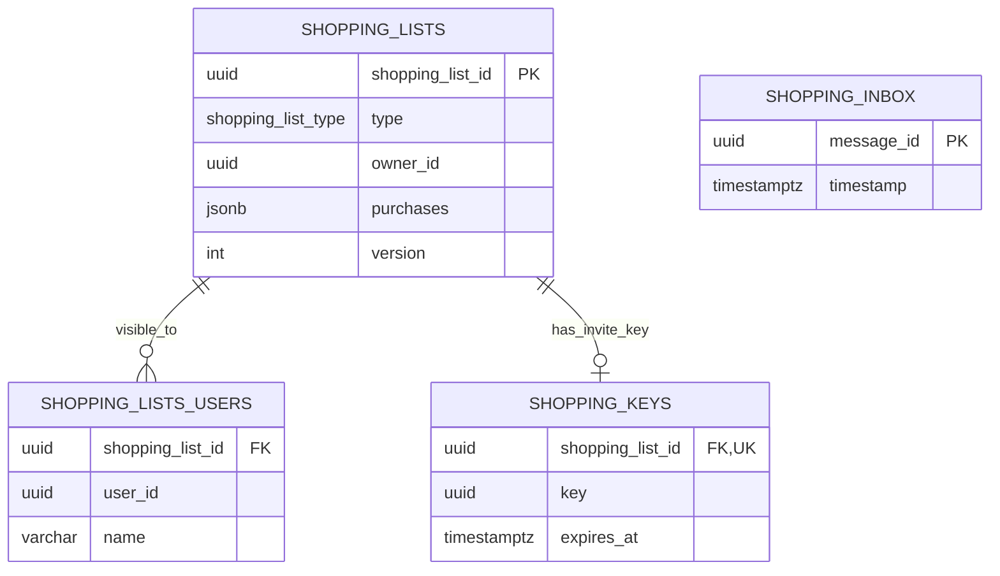

# ChefBook Backend Shopping List Service

The shopping-list service owns personal and shared shopping lists, per-user list names, list membership, invite keys, and shopping-list MQ processing.

## Responsibilities

- Personal shopping list reads and updates.
- Shared shopping list creation and deletion.
- Shared list membership and invite-link flow.
- Per-user display names for lists.
- Optimistic updates through list versioning.
- Recipe/profile-aware list flows.

## Main RPC Families

- `GetShoppingLists`
- `CreateSharedShoppingList`
- `GetShoppingList`
- `SetShoppingListName`
- `SetShoppingList`
- `AddPurchasesToShoppingList`
- `DeleteSharedShoppingList`
- `GetShoppingListUsers`
- `GetSharedShoppingListLink`
- `JoinShoppingList`
- `DeleteUserFromShoppingList`

## Dependencies

- Calls `profile` for shopping-list user/profile read data.
- Calls `recipe` for recipe-related shopping list flows.
- Consumes MQ messages when configured.
- Owns its PostgreSQL schema and migrations.

## Database Ownership

Owns:

- `shopping_lists` - list type, owner, purchases, and version.
- `shopping_lists_users` - list visibility and per-user list name.
- `shopping_keys` - invite keys for shared lists.
- `inbox` - idempotent MQ message processing.

Important constraints:

- `shopping_lists_users` is unique by list and user.
- `shopping_lists_users.name` is the user's display name for that list, not the profile/user name.
- `shopping_lists.version` is used for optimistic updates.
- Owner and member user IDs are logical cross-service references.
